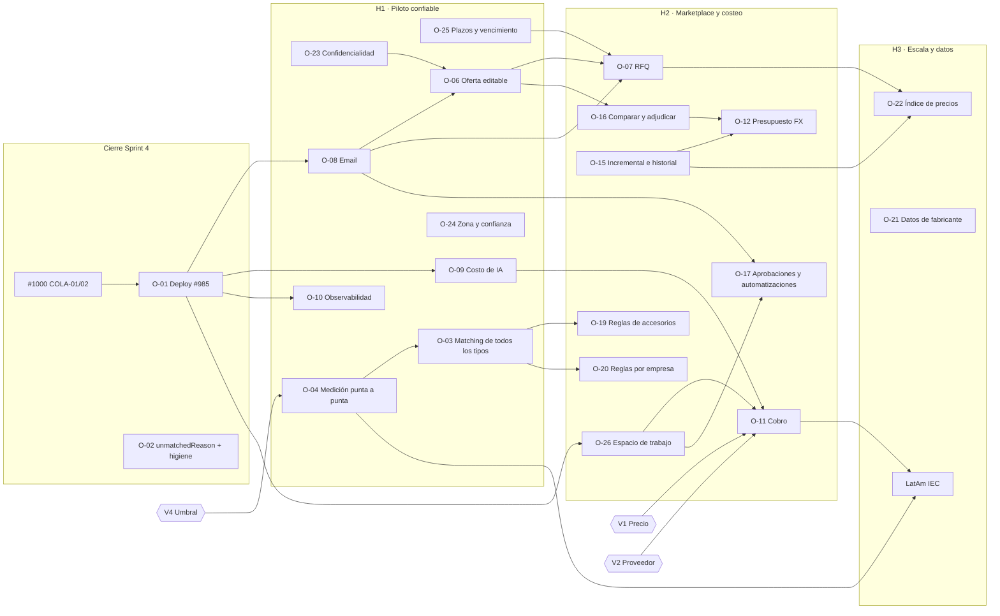

# 03 · Roadmap por dependencias

El orden sale de las dependencias y de criterios de entrada y salida, no de fechas. Los IDs O-xx son los de
`02-oportunidades.md`. Etiquetas de cifras: las de `01-estrategia.md`.

> **Que un flujo funcione en el prototipo no significa que su sprint de producción esté completo.** El prototipo
> (`liard-horizon`) corre sobre un store local con datos ficticios, IA simulada (`L.sim()`, "nunca llamadas reales",
> `CONTRATOS.md`) y funciones de dominio (`L.createRequest`, `L.submitOffer`, `L.award`, `L.decideApproval`…) **que no
> tienen equivalente en el backend**. Cada pantalla `propuesto` es un documento de diseño que se puede probar con
> usuarios, no código que se pueda desplegar. §5 lista el trabajo de producción que implica cada flujo.

---

## 1. Lo que queda del Sprint 4 (evidencia: `research/04 §1`)

| Pendiente | Evidencia | Criterio de "hecho" |
| --- | --- | --- |
| Deploy de prueba (#985) y su prerrequisito COLA-01/02 (#1000) | #985 con 0 casillas marcadas; no hay artefactos de deploy; ARQ:75 dice "Preparada, no desplegada". Fecha que se había previsto: 04/10 | URL pública con TLS, 5 cuentas reales creadas (≥ 3 de ingeniería y ≥ 1 distribuidor), backup diario verificado con una restauración y un plano procesado de punta a punta en la VM |
| Corregir `Roadmap.md` §Sprint 4.11 | Dice "Se desplegó" | El texto dice lo que es cierto |
| Mostrar `unmatchedReason` (O-02) | Ningún componente lo muestra | Cada línea NOT_FOUND muestra su motivo y lleva al editor |
| Cerrar #832, #930, #931, #970, #987 y #988 | Código ya en `dev` | Issues cerrados con referencia al PR |
| Videos #787 y #788 | Bloqueados por el nombre comercial (#834) | Decisión de nombre tomada y un video por rol grabado **sobre la instancia desplegada** |
| Avatar y renombrado (#824–#826) | Parciales | **Recomendación: sacarlos del Sprint 4.** No bloquean el piloto |

## 2. Sprint 5: lo planificado y los ajustes que recomiendo

| Ítem del Sprint 5 (Roadmap) | Recomendación | Motivo |
| --- | --- | --- |
| Extender el deploy (serverless) a más usuarios | **Posponer lo serverless**: primero sostener la VM con 5–10 usuarios | Con pocos usuarios, la VM cuesta USD 15–154 por mes [medido]. ARQ:233 dice que se migra cuando el costo fijo pese o haga falta escalar, y hoy no pasa ninguna de las dos |
| Matching para todos los componentes | **Mantener (O-03)**, medido con O-04 | Es el mayor generador de NOT_FOUND |
| BOM alternativo (#828–#831) | **Consolidar** con O-06 y O-16 | Ver `02 §Consolidadas` |
| Pagos: suscripción + comisión por lead | **Reemplazar** por la validación de precio (V1/V2) + facturación manual del piloto | No hay evidencia de disposición a pagar ni de aceptación de la comisión |
| Control de gasto de IA | **Mantener y adelantar (O-09)** | Es la condición para cualquier precio por tablero |
| Notificaciones por email | **Mantener y adelantar (O-08)** | S y de alta confianza |
| Observabilidad (#836) | **Mantener (O-10)**, lo mínimo para el piloto | Sin trazas, un piloto con problemas no se diagnostica |
| Evaluar DWG | **Solo el spike** de licencia y costo del conversor | Valor incierto: el PDF ya entra |
| Iterar detección y dataset (#1002, #901, #813) | **Condicionarlo** a los errores que aparezcan en el piloto | Priorizar por fallas observadas, no por hipótesis |
| — (no estaba) | **Agregar O-23** (confidencialidad), **O-04** (medición de punta a punta), **O-25** (plazos) y **O-06** (oferta editable) | Sin O-23 no entra ningún distribuidor real; sin O-06, el marketplace sigue siendo "precio de lista" |

---

## 3. Oleadas

### H1 · Piloto confiable (Argentina, segmento A + 3 distribuidores)

- **Entrada:** Sprint 4 cerrado con los criterios de §1.
- **Contenido:** O-01, O-23, O-02, O-04, O-08, O-25, O-09, O-10, O-03, O-06, O-24.
- **Salida (todas):** (a) ≥ 5 empresas usando la instancia desplegada durante 4 semanas y ≥ 3 activas en la semana 4;
  (b) acierto del matching de punta a punta medido y publicado, por encima del umbral acordado en V4; (c) minutos por
  tablero **con revisión incluida** ≥ 60 % por debajo de la línea base de cada empresa, en ≥ 5 planos reales por empresa
  (`research/05 §4`) [estimación, umbral propuesto]; (d) costo de IA por tablero medido en la base (no en
  `runs/…/components.json`); (e) ≥ 50 % de los pedidos respondidos por el distribuidor dentro de la plataforma; (f) V1 y
  V2 terminadas, con resultado.

### H2 · Marketplace con ofertas reales y costeo (se suma el segmento B)

- **Entrada:** salida de H1, y V1/V2 con un rango de precio que tenga al menos 3 compromisos de pago.
- **Contenido:** O-07 (RFQ), O-16 (comparación y adjudicación persistente), O-15 (incremental e historial), O-19, O-20,
  O-12 (presupuesto con FX), O-11 (cobro según V1/V2), O-26 (espacio de trabajo), O-17 (aprobaciones por monto).
- **Salida:** (a) ≥ 5 empresas pagando durante 3 meses seguidos; (b) mediana de respuesta del proveedor < 30 min (hoy
  2–3 h [entrevista]); (c) ≥ 80 % de las líneas de catálogo de los proveedores activos actualizadas hace menos de 7 días;
  (d) retención de los proveedores sin que haya comisión de por medio.

### H3 · Escala y datos (condicionado)

- **Entrada:** las 5 condiciones de expansión de `01-estrategia.md §7`.
- **Contenido:** región LatAm IEC con un socio local, O-22 (índice), O-21 (fabricantes), H-M4/H-M5 si V2 lo habilita,
  O-18 si el spike da un costo razonable, arquitectura serverless (ARQ:233) cuando la carga lo justifique, y O-13 solo si
  cumple su condición de diferimiento.
- **Salida:** unit economics positivos por cuenta en ≥ 2 países. Esto es **hipótesis**, no meta comprometida.

---

## 4. Grafo de dependencias

---

## 5. Del prototipo a los tickets de producción

### 5.1 Qué pantallas se convierten primero en tickets

| Orden | Pantalla del prototipo | Cap | Ticket de producción que abre | Por qué primero |
| --- | --- | --- | --- | --- |
| 1 | `d-cotizacion.html` (motivo del no-match) | existe | O-02 | S, sin backend nuevo |
| 2 | `d-prov-oferta.html` / `m-prov-oferta.html` | propuesto | O-06 | Es la mayor brecha de valor del lado comercial; probarla con 3 distribuidores **antes** de construir |
| 3 | `d-cuenta.html` (uso y tope de IA) | planificado | O-09 (solo la parte de uso y tope; la facturación espera a V1) | Protege el margen |
| 4 | `d-pedidos.html` / `d-prov-solicitudes.html` (plazo, VENCIDO) | existe | O-25 + O-08 | Usa columnas que ya existen |
| 5 | `d-directorio.html` | existe | O-24 | Datos ya guardados |
| 6 | `d-comparar.html` | propuesto | O-16 | Después de O-06 |
| 7 | `d-presupuesto.html` | propuesto | O-12 | H2, para el segmento B |
| — | `d-tablero-3d.html`, `d-asistentes.html`, `d-automatizaciones.html`, `d-inicio.html`, `d-prov-inicio.html` | propuesto | Ninguno por ahora | Sirven como material de discovery, no como backlog |

### 5.2 Trabajo de producción que implica cada flujo del prototipo

| Flujo del prototipo (`CONTRATOS.md`) | Qué falta en producción (modelos, rutas, procesos) |
| --- | --- |
| Solicitud → oferta (`L.createRequest`, `L.prefillOffer`, `L.saveOffer`, `L.submitOffer`, `L.declineOffer`) | Modelos `QuoteRequest` (obra, líneas, distribuidores, plazo, nota, alternativas permitidas), `SupplierOffer` (estado, vigencia, condición de pago, versión) y `SupplierOfferLine` (modo CATALOGO/AJUSTADO/ALTERNATIVA/SIN_OFERTA, stock CONFIRMADO/PARCIAL/A_PEDIDO/DESCONOCIDO, cantidad en stock, plazo, alternativa con tipo, atributos y equivalencia). Rutas nuevas bajo `/orders/supplier/*` o un módulo propio, con input/dto/mapper. Validación del lado del servidor equivalente a `L.validateOffer`. Actualizar `api-endpoints.md` y `front/src/service/api/` en el mismo cambio (regla del repo). Matriz de acceso: un distribuidor nunca ve a otro |
| Plazos y vencimiento | Escribir `responseDeadlineAt` y los estados `EXPIRED` (hoy inertes), más un barrido programado con lease, en el mismo estilo que `PlanProcessingRecoveryService`. Definir qué pasa con la adjudicación de un pedido vencido |
| Comparar y adjudicar (`L.compare`, `L.allocate`, `L.award`) | Persistir la adjudicación en el servidor (hoy `sessionStorage`); escribir `selectedOfferId` o crear un modelo `Award`; estado de equivalencia por línea (SUGERIDA/APROBADA/RECHAZADA) con quién la aprobó y cuándo; la generación de pedidos pasa a salir de la adjudicación. Hoy sale de `POST orders/projects/:projectId/quotes/:quoteId` |
| Aprobaciones (`L.decideApproval`, regla "si supera ARS 30.000.000") | Modelos `ApprovalRequest` y `ApprovalRule` (monto, rol aprobador). Requiere O-26: hoy no existe un segundo usuario en la obra. Bloquear la emisión mientras la aprobación esté pendiente |
| Notificaciones y correos (`s.notifications`, `s.outbox`) | Modelo `Notification` (in-app) y cola de envío, con plantillas en español sobre `IMailer`. Idempotencia por evento; preferencias por usuario. Hoy el mailer solo lo usa `auth` |
| Automatizaciones (`s.automations`) | Motor de reglas "cuando… entonces…" sobre eventos de dominio. Depende de Notification y de O-26 |
| Comentarios y actividad (`L.addComment`, `s.activity`) | Modelos `Comment` (entidad `line:`/`plan:`/`request:`) y `ActivityLog`, con alcance por obra y miembros |
| Presupuesto (`L.budget`, `L.scenarios`) | Modelo `SaleBudget` (horas por tablero, tarifa, extras, contingencia, margen, validez, inflación, escenario), la procedencia del costo (pedido > oferta vigente > referencia) y una fuente de FX con fecha. **No usar el TC ficticio del prototipo** (ver `04`) |
| IA con tope (`L.aiCan`, `L.aiSpend`) | Persistir el costo de la detección, que hoy solo está en `runs/…/components.json`; modelo `AiUsage` por espacio de trabajo; chequeo **antes** de encolar un plano y antes de cada lectura; alerta al 80 %; qué hacer con un plano a medio procesar cuando se alcanza el tope |
| Plan, uso y facturación (`s.billing`) | Modelos `Plan`, `Subscription`, `UsageRecord` e `Invoice`, y la decisión de pasarela o factura manual (AFIP). **Todo condicionado a V1/V2** |
| Espacio de trabajo y equipo | Modelos `Company` y `Membership` con roles internos; migrar todas las consultas que filtran por `ownerId`. Es L y toca las 14 carpetas de módulos |

---

## 6. Plan de validación de los huecos del discovery

| ID | Hueco (fuente) | Método | Criterio de decisión |
| --- | --- | --- | --- |
| **V1** | Disposición a pagar de las empresas: nunca se preguntó (`research/01 §3`) | Entrevistas de precio (Van Westendorp) con las 4 empresas del discovery y 4 nuevas, más una **oferta de piloto pago** con 3 niveles (referencias de `research/05 §3.3`: USD 60 / 150 / 400 por mes, o por plano) [estimación] | ≥ 3 compromisos firmados (carta de intención o primer pago) en el mismo nivel. Si no aparecen, se revisa la propuesta de valor antes de construir el cobro |
| **V2** | ¿El proveedor acepta comisión o prefiere suscripción? Nunca se preguntó (`research/01 §3`) | Con los 3 distribuidores del discovery y 3 nuevos: comparar suscripción, tarifa por RFQ calificada y % del pedido | Elegir el modelo que acepten ≥ 3 de 6. Si nadie acepta el %, queda descartado para H2 |
| **V3** | Confidencialidad y miedo competitivo (VIS §1.5) | En cada piloto, preguntar qué datos no subirían, a quién no querrían que vea su lista y qué exigen por escrito; revisar la política de datos con una empresa fuera del círculo de Liard | Política de datos firmada por ≥ 2 empresas que no sean Liard |
| **V4** | Umbral de precisión que genera confianza (DISC §Hipótesis) | Medir O-04 y, en paralelo, preguntar qué error aceptan por tablero (faltantes con precio) | Umbral acordado por escrito con ≥ 3 empresas; propuesta de partida: faltantes con precio ≤ 1 por tablero y ≥ 90 % de líneas aceptadas sin editar en tableros simples (`research/05 §4`) [estimación] |
| **V5** | Rol de CADIME (`research/01 §8.8`; no hay entrevista con Adrián Gutman) | Entrevista con Adrián Gutman y con la cámara: ¿canal de acceso a distribuidores, fuente de catálogo (la API en Zoho no se construyó) o accionista con conflicto? | Rol escrito (canal / datos / ninguno) y conflicto de interés declarado |
| **V6** | ¿El segmento B paga por costeo y FX? | Mostrarle `d-presupuesto.html` a GRAMONT y a otras 2 empresas maduras | ≥ 40 % dice que pagaría aparte (`research/05 §4`) [estimación] |
| **V7** | Oferta editable | Probar `d-prov-oferta.html` con 3 distribuidores, con una solicitud real de una obra piloto | Completan una oferta en < 30 min y ≥ 2 de 3 dicen que la usarían en lugar del email |

El prototipo sirve para V6 y V7 **porque** está hecho con datos ficticios: se valida la forma sin exponer precios reales.
